# レシピ一覧

すべてのレシピを、段階ごとに画像で並べたもの。`tools/gen_data.py` を実行すると自動で作り直される（手で書き換えない）。

## 段階1　起動

### 鋼の素

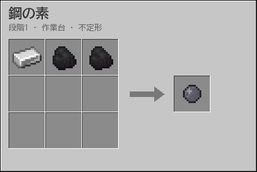

不定形レシピ

### 鋼鉄インゴット

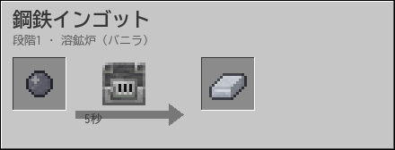

焼成炉なら2.5秒。共通タグ c:ingots/steel の他mod鋼鉄も可

### 未焼成セラミック

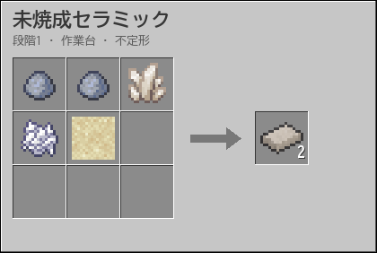

### ホワイトセラミック複合材

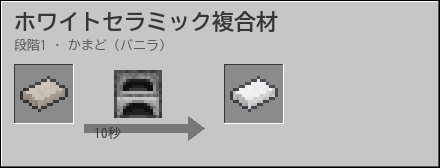

焼成炉なら2.5秒

### 基礎回路

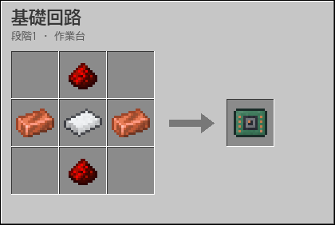

### Singuloハンドブック

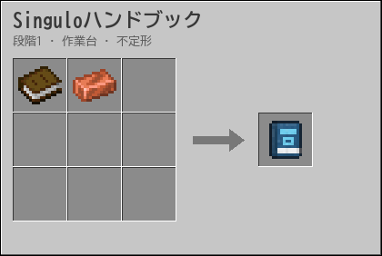

初めて入ったときにも1冊もらえる

### 設定カード

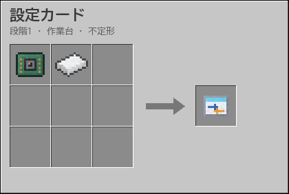

スニークして装置に使うと設定を写し、ほかの装置に使うと貼る

### 探索コンパス

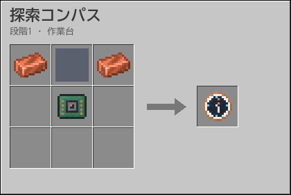

選んだ種類のいちばん近い遺構を指す

### ホロ投影機

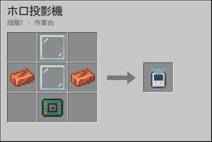

コントローラに使うと、マルチブロックの組み方を半透明で投影する

### 熱電対モジュール

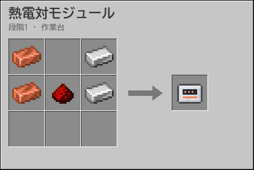

### 基礎フレーム

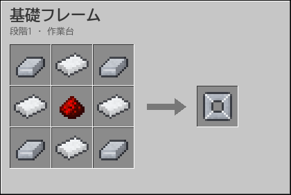

全装置の土台。白い外装

### 鋼板

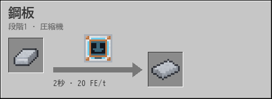

作業台なら鋼鉄2→1（効率半分）

### セラミック基板

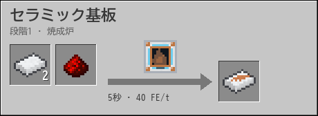

### 水素

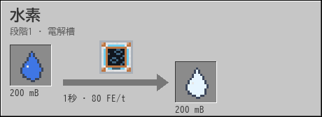

単位mB。副産物 酸素100 mB

### 銅導線

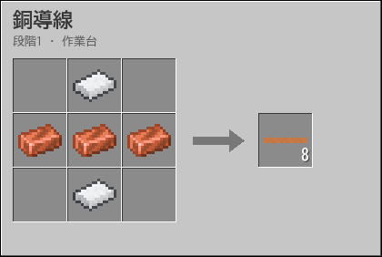

送電2 kFE/t、長距離で少し損失

### 白紙データカード

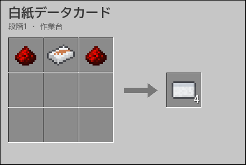

セラミック基板は焼成炉で作る

### データカード（観測ログ）

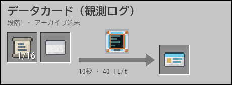

原本を1回ぶん読んで書き写す。レシピにはカードを使う

### 解読した記録

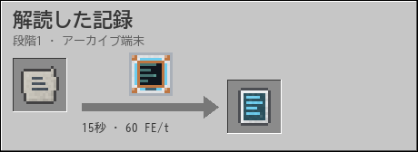

右クリックで読むと、ハンドブックの「旧文明の記録」に次の記録が加わる

### 圧縮ブロックLv1

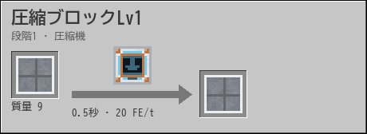

質量値9ぶんの任意ブロック（丸石なら9個）

### 質量ペレット

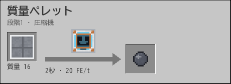

Pリアクターの燃料

### 熱電発電機

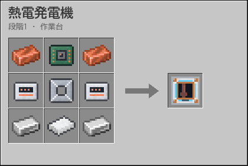

出力0.08 FE/t × 温度差K

### 焼成炉

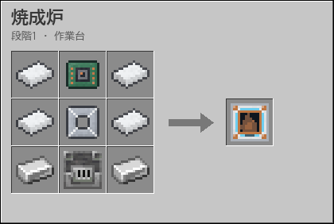

稼働時40 FE/t。焼成・製鋼を2倍速

### 圧縮機

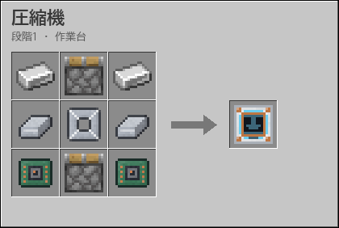

稼働時20 FE/t。圧縮・粉砕

### 電解槽

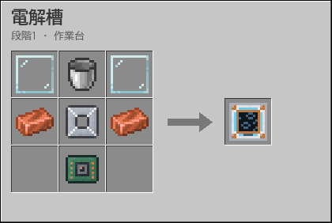

稼働時80 FE/t

### アーカイブ端末

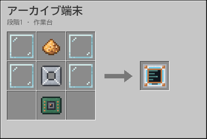

記録片の復号、次の目標パネル

## 段階2　極低温

### 冷却塔基部

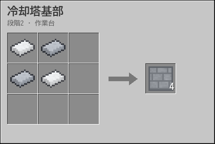

### 冷却塔外壁

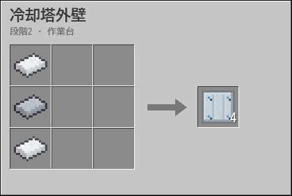

### 冷却塔ガラス

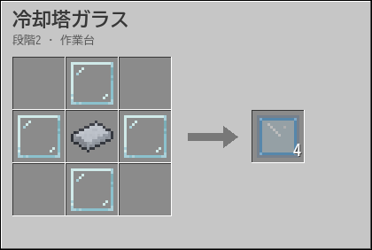

### 熱交換コア

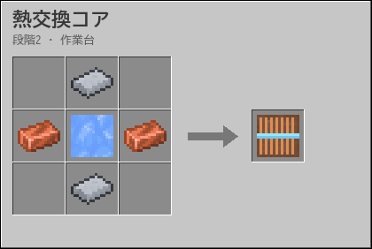

### 冷却塔冷却帯

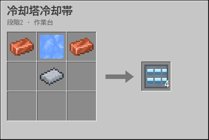

### 冷却塔頂部リム

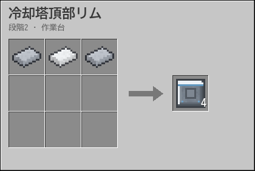

### 冷却塔通気格子

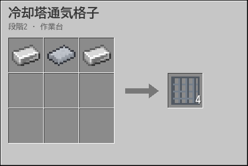

### マルチブロック搬入出ポート

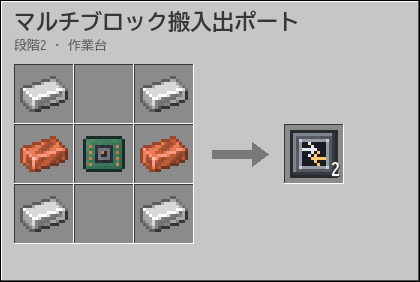

マルチブロックの外装板の代わりに置く（枠には置けない）。つないだケーブルやパイプはコントローラへ届き、出力は隣へ自動で押し出す

### 冷却塔コントローラ

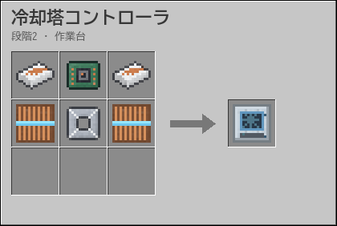

### 極低温冷却塔

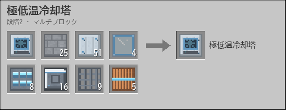

5×5の双曲面の塔、高さ7〜15（これは高さ7）。高さ10以上で液体ヘリウム可

### 液体窒素

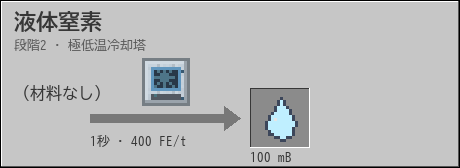

単位mB。空気から分離・液化（入力なし）

### 超伝導コイル

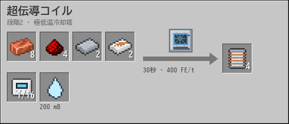

### 超伝導線材

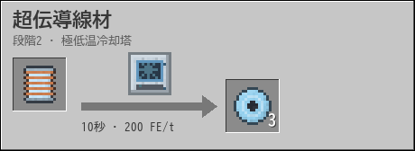

### 超伝導ケーブル

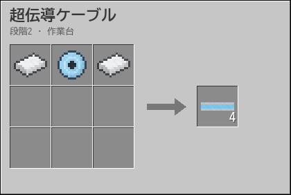

送電1 MFE/t、損失ゼロ

### 加速管

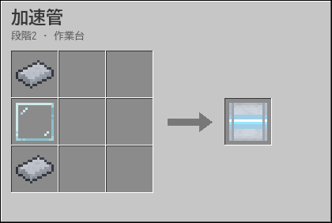

### 収束磁石

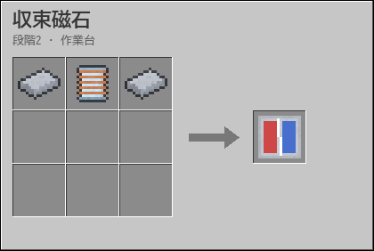

### 加速器コントローラ

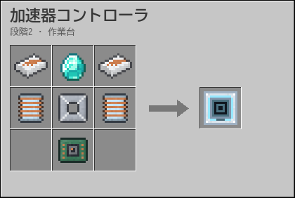

### 粒子加速器

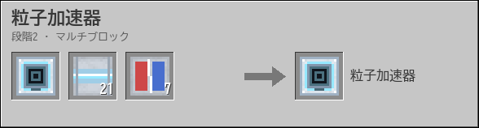

最小直径9（周28ブロック）。直径を広げるほど高速・単極子が出やすい

### ミュオン束

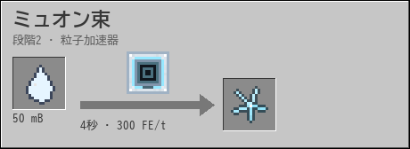

宇宙線ミュオン収集器でも無電力で少量

### 触媒反応器

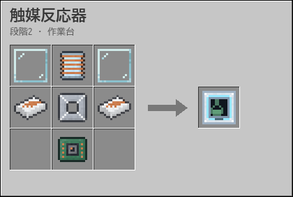

### ミュオン触媒

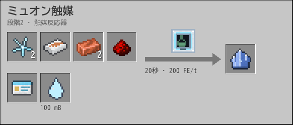

寿命20分（ティア2装置）

### 極低温タービン

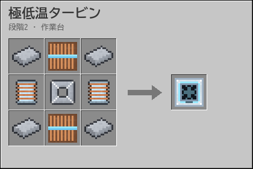

出力5 kFE/t。高温源×液体窒素の膨張

### 宇宙線ミュオン収集器

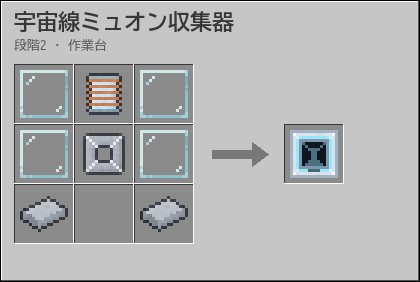

### SMESセル

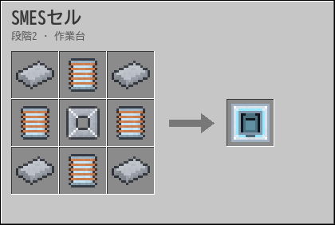

10 MFE蓄電

### 精密組立台

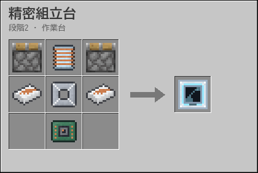

段階3以降の装置・部品・道具を組み立てる。材料は種類と個数だけで指定（入力6枠、各枠は何個でも可）

### ワールドライン・アンカー（小）

### ミュオン束（リサイクル）

### 単極子アップグレード

磁気単極子は粒子加速器の衝突で約1/1000

## 段階3　量子

### 冷却塔拡張（高さ10）

高さ7→10の増築分（くびれを3段のばす）

### ヘリウム

単位mB。玄武岩でも可（粉砕モード）

### 液体ヘリウム

高さ10以上の冷却塔が必要

### データカード（量子データ片）

### 量子演算モジュール

量子もつれ素子4個を1つの部品にまとめる

### 量子もつれ合成器

### 量子もつれ素子

必ず2個1組で出る

### レーザー冷却器

### 冷却原子

### 光格子基板

### BE凝縮触媒

寿命30分。ミュオン触媒は失活品でも可

### 量子熱機関

出力200 kFE/t。BE凝縮触媒を消費

### 重力波検出器

### ニュートリノ・スキャナー

### ニュートリノ観測所

電力で半径48を調べ続け、見つけた鉱石と遺構を近くの人に見せ続ける

### 慣性スタビライザー

### 残響共鳴器

稼働時4 kFE/t。型の残響の欠片の振動をスカルクに転写する

### 残響の欠片

型の欠片は消費されず16回で割れる（拾った1個から最大17個ぶん）

### 慣性制御ガントレット

### ミュオン触媒（リサイクル）

## 段階4　時間

### 圧縮ブロックLv2

質量値81

### 圧縮ブロックLv3

質量値729

### 縮退圧縮炉コントローラ

### 縮退圧縮炉フレーム

### 縮退圧縮炉装甲板

### 縮退圧縮炉ラム

### 縮退圧縮炉アンビル

### 縮退圧縮炉冷却口

### 縮退圧縮炉観察窓

### 縮退圧縮炉

5×5×5の閉じたプレス。天面のラムが底のアンビルへ打ち下ろす

### 金属圧縮ブロックLv1

質量値9ぶんの金属ブロック（鉄・銅・金・他modの金属タグ）。鉄ブロックなら3個

### 金属圧縮ブロックLv2

質量値81。重力崩壊の「鉄の核」

### 圧縮ブロックLv2（混成）

成果物は圧縮ブロックLv2。材料のLv1が3種類以上の元ブロックから作られているときだけ8個で済む（Lv2段だけ・約11%節約）

### 縮退物質殻

質量値5,994。金属の核2個がないと崩壊が始まらない。圧縮熱を液体窒素で除去（質量1あたり約1 mB）

### 縮退物質殻（ストレンジ物質）

ストレンジ物質（質量値100）はすでに縮退しているので、液体窒素が半分で済む

### 鏡面プレート

### C空洞コントローラ

### C空洞フレーム

### C空洞真空ポンプ

### C空洞容器壁

### C空洞磁気シールド

### C空洞観察窓

### C空洞

5×5×5の真空容器。天面と底面の内側に向かい合う2枚の鏡面

### アクシオン凝縮体

単位mB。強磁場モード（入力なし）

### データカード（培養データ）

### 時間結晶育成槽

### 時間結晶触媒

寿命45分。育成20分なので、育成槽1台で触媒を使う装置2台を回せる

### エキゾチック物質

時間結晶触媒をスロットで2分ぶん消耗。ネザースターは人工星核でも可（タグ singulo:star_core）

### 縮退熱炉フレーム

### 縮退熱炉外装板

### 縮退熱炉ピストン部

### 縮退熱炉放熱フィン

### 縮退熱炉熱交換管

### 縮退熱炉観察窓

### 縮退熱炉コントローラ

### 縮退熱炉

5×5×7の閉じた炉。出力20 MFE/t、燃料は圧縮ブロックLv2、時間結晶触媒を消費。外装板はマルチブロック搬入出ポートに替えられる

### トポロジカル導線

送電100 MFE/t、損失ゼロ

### トロイダル磁気コイル

トポロジカル導線8本を巻いたドーナツ型のコイル

### SMESモジュール

2 GFE蓄電

### 自動探査機ステーション

### 磁気瓶

### BE凝縮触媒（リサイクル）

## 段階5　特異点

### ホライズン・バス

送電4 GFE/t、損失ゼロ

### 炉殻ブロック

殻1個を12枚の炉殻に成形

### ジャイロ駆動部

### 抽出ポート

### 重力場安定化ユニット

エキゾチック物質で局所の重力場を固定する部品

### 炉心制御装置

### 炉心安定化コイル

### 炉心質量警報器

炉殻の代わりにリングのどこにでも置ける。炉心の質量が上限に達すると赤石信号を出す

### Pリアクター

13×13×13。直交するリング3本。交点6か所にジャイロ、斜め45°の12か所に安定化コイル。抽出ポートと警報器は炉殻の代わりにどこにでも置ける

### 空のBH格納容器

### 小型BH格納容器

小さなブラックホールを閉じ込めた容器。爆弾やマニピュレーターの材料

### ブラックホール爆弾

投げると、当たった所に6秒ほど小さなブラックホールが開く

### Hコレクター

### ジェット・コレクター

### エルゴスフィア・リング

### ジェット凝縮体

発電中、ジェット・コレクター1基につき1分に1個。発電は止めない

### 人工星核

ネザースターの代わりになる（タグ singulo:star_core）。点火後に作れる

### H凝縮体

炉心質量150〜400で5分に1個

### 特異点封入台

### 特異点の種

最初の点火に使う一回限りの素材。休眠状態を縮退物質殻で包んで目覚めさせる

### シンギュラリティ・コア

寿命60分。装置に埋め込むと永続。ネザースターは人工星核でも可

### ハロー捕集器

ダークマター（WIMP）を回収

### ダークマター

炉心から16ブロック以内。炉心質量100ごとに毎秒1 mB

### 重力閉じ込めタンク

### シールド許可証

シールド発生塔の許可証スロットに入れると、守りの中で設置・破壊・取り出しができるのは登録した人だけになる

### シールド発生塔コア

### シールド発生塔基壇

### シールド発生塔電力コイル

### シールド発生塔本体

### シールド発生塔導波管

### シールド発生塔放射冠

### イベントホライズン・シールド発生塔

5×5の基壇から尖塔へすぼまる高さ9の塔

### ワールドライン・アンカー（上位）

### メトリック・ドライブ

### グラビトン・マニピュレーター

### Tコア

### Tシリンダーフレーム

### Tシリンダー外殻

### Tシリンダー軸受

### Tシリンダー観察窓

### Tシリンダー時間結晶ホルダー

### Tシリンダー

5×5×9の格納筒。中で円柱が回る

### ワームホール生成器コア

### ワームホール生成器外殻

### ワームホール生成器場コイル

### ワームホール生成器収束器

### ワームホール生成器観察窓

### ワームホール生成器

5×5×5の球。外殻の代わりにマルチブロック搬入出ポートを置くと、電力を入れ、できた口を押し出す

### 不安定なワームホールの口

一対で生まれる。60秒以内に固定化しないと消える

### ワームホールの口

### ワームホール固定化装置

### ワームホール・ポート

### 時間結晶触媒（リサイクル）

