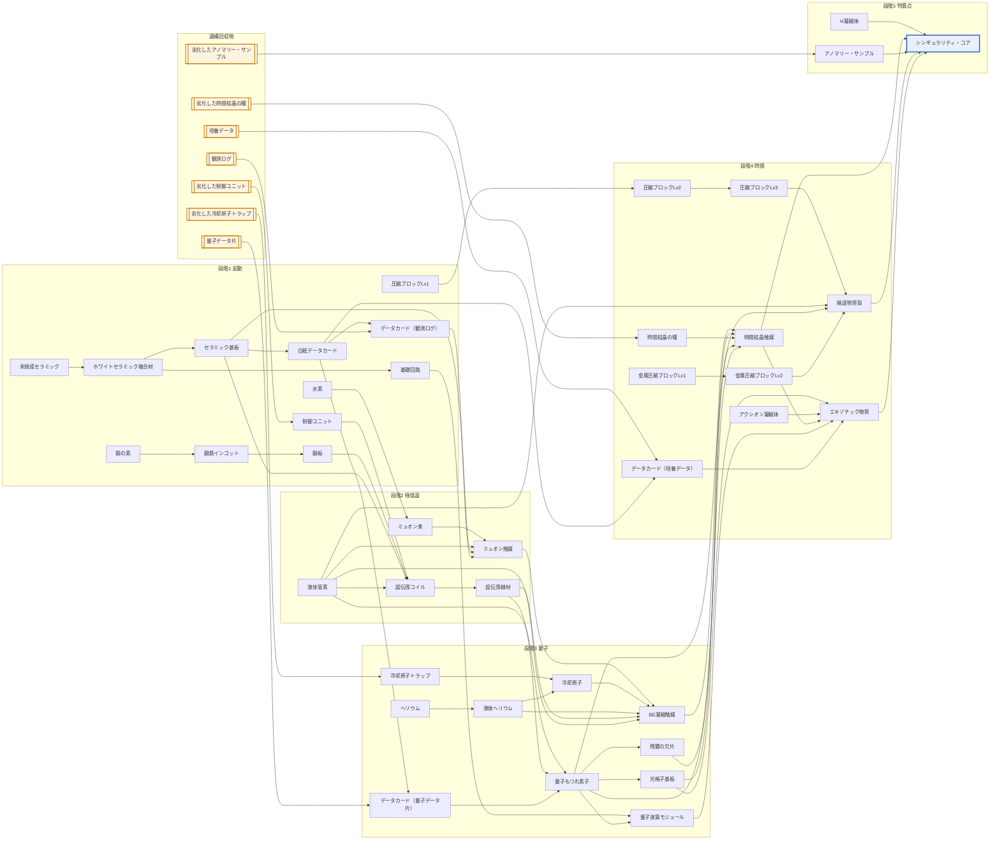

# Singulo 装置・素材・レシピ詳細設計

対象: Minecraft 1.21.1 / NeoForge。この文書は `tools/recipes.py`（レシピの唯一の正）から `tools/balance/gen_md.py` で自動生成し、難易度の計算は `tools/balance/analyze.py`、整合性の検証は `tools/gen_data.py` で行っている。数値はプレイテスト前の初期値で、サーバー設定とデータパックで変更できる前提。

## 読み方

- **個数**: 材料の後ろの「×n」は1回の製作で使う数。成果物の個数は「出力」列。
- **流体・ガス**: 単位はmB。配管がない環境ではガスボンベ（アイテム）に詰めて運べる。
- **遺構回収物**はそのままではレシピに使えない。データ系は白紙データカードに書き写し、部品系は装置で復元してから使う。どちらも使用回数制で、使い切っても修復・再復元でき、そのたびに最大使用回数が×0.75になる（3回まで）。
- **作業台と精密組立台**: 段階1〜2は作業台（3×3の枠、材料は合計9個まで）。段階3以降の装置・部品・道具は、段階2の終わりに作る精密組立台で組み立てる。精密組立台は枠の形を使わず、材料の種類（6枠まで）と個数だけで指定する。電力で動くので自動化もできる。
- **製作場所**: 作業台・バニラのかまど・溶鉱炉、または本modの装置。上位段階の装置で同じレシピを処理すると、1段ごとに速度×2・電力効率+25%（段階3以降は最大4並列）。
- **電力**: 表の値は処理中の消費（FE/t）。総消費は「消費 × 20 × 秒数」。

## 段階と到達セット

各段階の「到達セット」は、次の段階に進むまでに作るものの目安。難易度検証はこのセットを原料まで展開して計算している。

| 段階 | 名前 | 到達セット | 使える発電（前段階まで） |
| --- | --- | --- | --- |
| 1 | 起動 | 熱電発電機×8、焼成炉×1、圧縮機×1、電解槽×1、アーカイブ端末×1 | 480 FE/t |
| 2 | 極低温 | 精密組立台×1、極低温冷却塔×1、粒子加速器×1、触媒反応器×1、極低温タービン×2、ミュオン触媒×4 | 480 FE/t |
| 3 | 量子 | 冷却塔拡張（高さ10）×1、量子もつれ合成器×1、レーザー冷却器×1、量子熱機関×1、重力波検出器×1、BE凝縮触媒×4 | 10.48 kFE/t |
| 4 | 時間 | 残響共鳴器×1、縮退圧縮炉×1、C空洞×1、時間結晶育成槽×1、縮退熱炉×1、時間結晶触媒×4、エキゾチック物質×8 | 210.48 kFE/t |
| 5 | 特異点 | Pリアクター×1、SMESモジュール×25、ホライズン・バス×16、特異点封入台×1、特異点の種×1、ジェット・コレクター×1、Hコレクター×1、シンギュラリティ・コア×1 | 20 MFE/t |

## 製作場所ごとの製作物

どの装置で何が作れるかの一覧。装置自体のレシピは段階別レシピの表にある。

| 製作場所 | 段階 | 種類 | 作れるもの |
| --- | --- | --- | --- |
| かまど（バニラ） | — | バニラ | ホワイトセラミック複合材 |
| 作業台 | — | バニラ | 鋼の素、未焼成セラミック、基礎回路、Singuloハンドブック、探索コンパス、ホロ投影機、熱電対モジュール、基礎フレーム、銅導線、白紙データカード、熱電発電機、焼成炉、圧縮機、電解槽、アーカイブ端末、冷却塔外壁、冷却塔ガラス、熱交換コア、冷却塔ポート、冷却塔コントローラ、超伝導ケーブル、加速管、収束磁石、加速器コントローラ、触媒反応器、極低温タービン、宇宙線ミュオン収集器、SMESセル、精密組立台、ワールドライン・アンカー（小）、単極子アップグレード |
| 溶鉱炉（バニラ） | — | バニラ | 鋼鉄インゴット |
| アーカイブ端末 | 1 | 加工装置 | データカード（観測ログ）、解読した記録、データカード（量子データ片）、データカード（培養データ） |
| 圧縮機 | 1 | 加工装置 | 鋼板、圧縮ブロックLv1、質量ペレット、ヘリウム、圧縮ブロックLv2、圧縮ブロックLv3、金属圧縮ブロックLv1、金属圧縮ブロックLv2、圧縮ブロックLv2（混成） |
| 焼成炉 | 1 | 加工装置 | セラミック基板 |
| 電解槽 | 1 | 加工装置 | 水素 |
| 極低温冷却塔 | 2 | マルチブロック | 液体窒素、超伝導コイル、超伝導線材、液体ヘリウム、トポロジカル導線 |
| 粒子加速器 | 2 | マルチブロック | ミュオン束 |
| 精密組立台 | 2 | 加工装置 | 量子演算モジュール、量子もつれ合成器、レーザー冷却器、量子熱機関、重力波検出器、ニュートリノ・スキャナー、慣性スタビライザー、残響共鳴器、慣性制御ガントレット、縮退炉外殻、縮退圧縮炉コントローラ、鏡面プレート、C空洞コントローラ、時間結晶育成槽、縮退熱炉ピストン部、縮退熱炉コントローラ、トロイダル磁気コイル、SMESモジュール、自動探査機ステーション、磁気瓶、ジャイロ駆動部、抽出ポート、重力場安定化ユニット、炉心制御装置、Hコレクター、ジェット・コレクター、エルゴスフィア・リング、特異点封入台、ハロー捕集器、重力閉じ込めタンク、シールド発生塔コア、ワールドライン・アンカー（上位）、メトリック・ドライブ、グラビトン・マニピュレーター、Tコア、ワームホール生成器コア、ワームホール固定化装置、ワームホール・ポート |
| 触媒反応器 | 2 | 加工装置 | ミュオン触媒、ミュオン束（リサイクル）、ミュオン触媒（リサイクル）、BE凝縮触媒（リサイクル）、時間結晶触媒（リサイクル） |
| レーザー冷却器 | 3 | 加工装置 | 冷却原子、光格子基板、BE凝縮触媒 |
| 残響共鳴器 | 3 | 加工装置 | 残響の欠片 |
| 量子もつれ合成器 | 3 | 加工装置 | 量子もつれ素子 |
| C空洞 | 4 | マルチブロック | アクシオン凝縮体、エキゾチック物質 |
| 時間結晶育成槽 | 4 | 加工装置 | 時間結晶触媒 |
| 縮退圧縮炉 | 4 | マルチブロック | 縮退物質殻、縮退物質殻（ストレンジ物質）、ホライズン・バス、炉殻ブロック |
| ハロー捕集器 | 5 | 加工装置 | ダークマター |
| ワームホール固定化装置 | 5 | 特異点技術 | ワームホールの口 |
| ワームホール生成器 | 5 | 特異点技術 | 不安定なワームホールの口 |
| 特異点封入台 | 5 | 加工装置 | 人工星核、特異点の種、シンギュラリティ・コア |
| Pリアクター（発電モード） | — | バニラ | ジェット凝縮体 |
| Pリアクター（触媒モード） | 5 | マルチブロックの運用モード | H凝縮体 |
| マルチブロック組み立て | — | 設置して形成 | 極低温冷却塔、冷却塔拡張（高さ10）、粒子加速器、縮退圧縮炉、C空洞、縮退熱炉、Pリアクター、イベントホライズン・シールド発生塔、Tシリンダー、ワームホール生成器 |

## 段階別レシピ

### 段階1: 起動

**中間素材**

| 成果物 | 出力 | 製作場所 | 材料 | 時間 | 電力 | 備考 |
| --- | --- | --- | --- | --- | --- | --- |
| 鋼の素 | ×1 | 作業台 | 鉄インゴット ×1、石炭 ×2 | 即時 | — | 不定形レシピ |
| 鋼鉄インゴット | ×1 | 溶鉱炉（バニラ） | 鋼の素 ×1 | 5秒 | — | 焼成炉なら2.5秒。共通タグ c:ingots/steel の他mod鋼鉄も可 |
| 未焼成セラミック | ×2 | 作業台 | 粘土玉 ×2、ネザー水晶 ×1、骨粉 ×1、砂 ×1 | 即時 | — |  |
| ホワイトセラミック複合材 | ×1 | かまど（バニラ） | 未焼成セラミック ×1 | 10秒 | — | 焼成炉なら2.5秒 |
| 基礎回路 | ×1 | 作業台 | ホワイトセラミック複合材 ×1、レッドストーン ×2、銅インゴット ×1 | 即時 | — |  |
| 熱電対モジュール | ×1 | 作業台 | 銅インゴット ×2、鉄インゴット ×2、レッドストーン ×1 | 即時 | — |  |
| 基礎フレーム | ×1 | 作業台 | 鋼鉄インゴット ×4、ホワイトセラミック複合材 ×4、レッドストーン ×1 | 即時 | — | 全装置の土台。白い外装 |
| 鋼板 | ×1 | 圧縮機 | 鋼鉄インゴット ×1 | 2秒 | 20 FE/t | 作業台なら鋼鉄2→1（効率半分） |
| セラミック基板 | ×1 | 焼成炉 | ホワイトセラミック複合材 ×2、レッドストーン ×1 | 5秒 | 40 FE/t |  |
| 水素 | 200 mB | 電解槽 | 水 200 mB | 1秒 | 80 FE/t | 単位mB。副産物 酸素100 mB |
| 白紙データカード | ×4 | 作業台 | セラミック基板 ×1、レッドストーン ×2 | 即時 | — | セラミック基板は焼成炉で作る |
| データカード（観測ログ） | ×1 | アーカイブ端末 | 観測ログ（1回分／全16回）、白紙データカード ×1 | 10秒 | 40 FE/t | 原本を1回ぶん読んで書き写す。レシピにはカードを使う |
| 圧縮ブロックLv1 | ×1 | 圧縮機 | 質量値 9 ぶんのブロック | 0.5秒 | 20 FE/t | 質量値9ぶんの任意ブロック（丸石なら9個） |
| 質量ペレット | ×1 | 圧縮機 | 質量値 16 ぶんのブロック | 2秒 | 20 FE/t | Pリアクターの燃料 |

**ケーブル**

| 成果物 | 出力 | 製作場所 | 材料 | 時間 | 電力 | 備考 |
| --- | --- | --- | --- | --- | --- | --- |
| 銅導線 | ×8 | 作業台 | 銅インゴット ×3、ホワイトセラミック複合材 ×1 | 即時 | — | 送電2 kFE/t、長距離で少し損失 |

**加工装置**

| 成果物 | 出力 | 製作場所 | 材料 | 時間 | 電力 | 備考 |
| --- | --- | --- | --- | --- | --- | --- |
| 焼成炉 | ×1 | 作業台 | 基礎フレーム ×1、溶鉱炉 ×1、基礎回路 ×1、ホワイトセラミック複合材 ×4 | 即時 | — | 稼働時40 FE/t。焼成・製鋼を2倍速 |
| 圧縮機 | ×1 | 作業台 | 基礎フレーム ×1、ピストン ×2、基礎回路 ×1、鋼鉄インゴット ×2 | 即時 | — | 稼働時20 FE/t。圧縮・粉砕 |
| 電解槽 | ×1 | 作業台 | 基礎フレーム ×1、ガラス ×2、基礎回路 ×1、バケツ ×1、銅インゴット ×2 | 即時 | — | 稼働時80 FE/t |
| アーカイブ端末 | ×1 | 作業台 | 基礎フレーム ×1、ガラス ×4、基礎回路 ×1、グロウストーンダスト ×2 | 即時 | — | 記録片の復号、次の目標パネル |

**発電機**

| 成果物 | 出力 | 製作場所 | 材料 | 時間 | 電力 | 備考 |
| --- | --- | --- | --- | --- | --- | --- |
| 熱電発電機 | ×1 | 作業台 | 基礎フレーム ×1、熱電対モジュール ×2、基礎回路 ×1、銅インゴット ×2 | 即時 | — | 出力0.08 FE/t × 温度差K |

**道具**

| 成果物 | 出力 | 製作場所 | 材料 | 時間 | 電力 | 備考 |
| --- | --- | --- | --- | --- | --- | --- |
| Singuloハンドブック | ×1 | 作業台 | 本 ×1、銅インゴット ×1 | 即時 | — | 初めて入ったときにも1冊もらえる |
| 探索コンパス | ×1 | 作業台 | コンパス ×1、基礎回路 ×1、銅インゴット ×2 | 即時 | — | 選んだ種類のいちばん近い遺構を指す |
| ホロ投影機 | ×1 | 作業台 | 基礎回路 ×1、ガラス ×2、銅インゴット ×2 | 即時 | — | コントローラに使うと、マルチブロックの組み方を半透明で投影する |
| 解読した記録 | ×1 | アーカイブ端末 | 記録片 ×1 | 15秒 | 60 FE/t | 右クリックで読むと、ハンドブックの「旧文明の記録」に次の記録が加わる |

### 段階2: 極低温

**中間素材**

| 成果物 | 出力 | 製作場所 | 材料 | 時間 | 電力 | 備考 |
| --- | --- | --- | --- | --- | --- | --- |
| 液体窒素 | 100 mB | 極低温冷却塔 | 入力なし | 1秒 | 400 FE/t | 単位mB。空気から分離・液化（入力なし） |
| 超伝導コイル | ×4 | 極低温冷却塔 | 銅インゴット ×8、レッドストーン ×4、鋼板 ×2、セラミック基板 ×2、制御ユニット（1回分／全16回）、液体窒素 200 mB | 30秒 | 400 FE/t |  |
| 超伝導線材 | ×3 | 極低温冷却塔 | 超伝導コイル ×1 | 10秒 | 200 FE/t |  |
| ミュオン束 | ×1 | 粒子加速器 | 水素 50 mB | 4秒 | 300 FE/t | 宇宙線ミュオン収集器でも無電力で少量 |

**触媒**

| 成果物 | 出力 | 製作場所 | 材料 | 時間 | 電力 | 備考 |
| --- | --- | --- | --- | --- | --- | --- |
| ミュオン触媒 | ×1 | 触媒反応器 | ミュオン束 ×2、セラミック基板 ×1、銅インゴット ×2、レッドストーン ×1、データカード（観測ログ） ×1、液体窒素 100 mB | 20秒 | 200 FE/t | 寿命20分（ティア2装置） |
| ミュオン束（リサイクル） | ×2 | 触媒反応器 | 失活したミュオン触媒 ×4 | 10秒 | 200 FE/t |  |

**構造部品**

| 成果物 | 出力 | 製作場所 | 材料 | 時間 | 電力 | 備考 |
| --- | --- | --- | --- | --- | --- | --- |
| 冷却塔外壁 | ×2 | 作業台 | ホワイトセラミック複合材 ×2、鋼板 ×1 | 即時 | — |  |
| 冷却塔ガラス | ×4 | 作業台 | ガラス ×4、鋼板 ×1 | 即時 | — |  |
| 熱交換コア | ×1 | 作業台 | 銅インゴット ×2、鋼板 ×1、青氷 ×1 | 即時 | — |  |
| 冷却塔ポート | ×1 | 作業台 | 冷却塔外壁 ×2、基礎回路 ×1 | 即時 | — |  |
| 冷却塔コントローラ | ×1 | 作業台 | 基礎フレーム ×1、セラミック基板 ×2、基礎回路 ×1、熱交換コア ×2 | 即時 | — |  |
| 加速管 | ×1 | 作業台 | 鋼板 ×2、ガラス ×1 | 即時 | — |  |
| 収束磁石 | ×1 | 作業台 | 超伝導コイル ×1、鋼板 ×2 | 即時 | — |  |
| 加速器コントローラ | ×1 | 作業台 | 基礎フレーム ×1、超伝導コイル ×2、セラミック基板 ×2、基礎回路 ×1、ダイヤモンド ×1 | 即時 | — |  |

**ケーブル**

| 成果物 | 出力 | 製作場所 | 材料 | 時間 | 電力 | 備考 |
| --- | --- | --- | --- | --- | --- | --- |
| 超伝導ケーブル | ×4 | 作業台 | 超伝導線材 ×1、ホワイトセラミック複合材 ×2 | 即時 | — | 送電1 MFE/t、損失ゼロ |

**加工装置**

| 成果物 | 出力 | 製作場所 | 材料 | 時間 | 電力 | 備考 |
| --- | --- | --- | --- | --- | --- | --- |
| 触媒反応器 | ×1 | 作業台 | 基礎フレーム ×1、超伝導コイル ×1、セラミック基板 ×2、基礎回路 ×1、ガラス ×2 | 即時 | — |  |
| 宇宙線ミュオン収集器 | ×1 | 作業台 | 基礎フレーム ×1、ガラス ×4、超伝導コイル ×1、鋼板 ×2 | 即時 | — |  |
| 精密組立台 | ×1 | 作業台 | 基礎フレーム ×1、超伝導コイル ×1、セラミック基板 ×2、ピストン ×2、基礎回路 ×1 | 即時 | — | 段階3以降の装置・部品・道具を組み立てる。材料は種類と個数だけで指定（入力6枠、各枠は何個でも可） |

**発電機**

| 成果物 | 出力 | 製作場所 | 材料 | 時間 | 電力 | 備考 |
| --- | --- | --- | --- | --- | --- | --- |
| 極低温タービン | ×1 | 作業台 | 基礎フレーム ×1、超伝導コイル ×2、鋼板 ×4、熱交換コア ×2 | 即時 | — | 出力5 kFE/t。高温源×液体窒素の膨張 |

**蓄電・貯蔵**

| 成果物 | 出力 | 製作場所 | 材料 | 時間 | 電力 | 備考 |
| --- | --- | --- | --- | --- | --- | --- |
| SMESセル | ×1 | 作業台 | 基礎フレーム ×1、超伝導コイル ×4、鋼板 ×2 | 即時 | — | 10 MFE蓄電 |

**マルチブロック**

| 成果物 | 出力 | 製作場所 | 材料 | 時間 | 電力 | 備考 |
| --- | --- | --- | --- | --- | --- | --- |
| 極低温冷却塔 | ×1 | マルチブロック組み立て | 冷却塔コントローラ ×1、冷却塔ポート ×2、冷却塔ガラス ×8、冷却塔外壁 ×29、熱交換コア ×3 | 即時 | — | 最小3×3×5。高さ10以上で液体ヘリウム可 |
| 粒子加速器 | ×1 | マルチブロック組み立て | 加速器コントローラ ×1、加速管 ×21、収束磁石 ×7 | 即時 | — | 最小直径9（周28ブロック）。直径を広げるほど高速・単極子が出やすい |

**アップグレード**

| 成果物 | 出力 | 製作場所 | 材料 | 時間 | 電力 | 備考 |
| --- | --- | --- | --- | --- | --- | --- |
| 単極子アップグレード | ×1 | 作業台 | 磁気単極子 ×1、超伝導コイル ×1、鋼板 ×2 | 即時 | — | 磁気単極子は粒子加速器の衝突で約1/1000 |

**特異点技術**

| 成果物 | 出力 | 製作場所 | 材料 | 時間 | 電力 | 備考 |
| --- | --- | --- | --- | --- | --- | --- |
| ワールドライン・アンカー（小） | ×1 | 作業台 | 基礎フレーム ×1、エンダーパール ×2、超伝導コイル ×1、基礎回路 ×1 | 即時 | — |  |

### 段階3: 量子

**中間素材**

| 成果物 | 出力 | 製作場所 | 材料 | 時間 | 電力 | 備考 |
| --- | --- | --- | --- | --- | --- | --- |
| ヘリウム | 20 mB | 圧縮機 | 深層岩 ×16 | 8秒 | 20 FE/t | 単位mB。玄武岩でも可（粉砕モード） |
| 液体ヘリウム | 100 mB | 極低温冷却塔 | ヘリウム 100 mB | 5秒 | 2 kFE/t | 高さ10以上の冷却塔が必要 |
| データカード（量子データ片） | ×1 | アーカイブ端末 | 量子データ片（1回分／全16回）、白紙データカード ×1 | 10秒 | 40 FE/t |  |
| 量子もつれ素子 | ×2 | 量子もつれ合成器 | ネザー水晶 ×2、アメジストの欠片 ×2、ダイヤモンド ×1、超伝導線材 ×1、液体窒素 50 mB、データカード（量子データ片） ×1 | 30秒 | 4 kFE/t | 必ず2個1組で出る |
| 冷却原子 | ×2 | レーザー冷却器 | アメジストの欠片 ×1、ネザー水晶 ×1、液体ヘリウム 10 mB、冷却原子トラップ（1回分／全32回） | 10秒 | 4 kFE/t |  |
| 光格子基板 | ×2 | レーザー冷却器 | ネザー水晶 ×2、量子もつれ素子 ×1 | 20秒 | 4 kFE/t |  |
| 残響の欠片 | ×1 | 残響共鳴器 | 残響の欠片（型として1回分／全16回）、スカルク ×16、アメジストの欠片 ×4、量子もつれ素子 ×1 | 2分 | 4 kFE/t | 型の欠片は消費されず16回で割れる（拾った1個から最大17個ぶん） |

**触媒**

| 成果物 | 出力 | 製作場所 | 材料 | 時間 | 電力 | 備考 |
| --- | --- | --- | --- | --- | --- | --- |
| BE凝縮触媒 | ×1 | レーザー冷却器 | 冷却原子 ×4、超伝導線材 ×2、ミュオン触媒 ×1、液体窒素 100 mB、液体ヘリウム 25 mB | 40秒 | 8 kFE/t | 寿命30分。ミュオン触媒は失活品でも可 |
| ミュオン触媒（リサイクル） | ×1 | 触媒反応器 | 失活したBE凝縮触媒 ×4、液体窒素 100 mB | 20秒 | 400 FE/t |  |

**構造部品**

| 成果物 | 出力 | 製作場所 | 材料 | 時間 | 電力 | 備考 |
| --- | --- | --- | --- | --- | --- | --- |
| 量子演算モジュール | ×1 | 精密組立台 | 量子もつれ素子 ×4、基礎回路 ×1 | 10秒 | 100 FE/t | 量子もつれ素子4個を1つの部品にまとめる |

**加工装置**

| 成果物 | 出力 | 製作場所 | 材料 | 時間 | 電力 | 備考 |
| --- | --- | --- | --- | --- | --- | --- |
| 量子もつれ合成器 | ×1 | 精密組立台 | 基礎フレーム ×1、超伝導コイル ×2、セラミック基板 ×2、ダイヤモンド ×1、ガラス ×4 | 10秒 | 100 FE/t |  |
| レーザー冷却器 | ×1 | 精密組立台 | 基礎フレーム ×1、ダイヤモンド ×2、超伝導コイル ×1、セラミック基板 ×2、グロウストーンダスト ×4、ガラス ×2 | 12秒 | 100 FE/t |  |
| 重力波検出器 | ×1 | 精密組立台 | 基礎フレーム ×1、量子演算モジュール ×1、ダイヤモンド ×2、鋼板 ×4、コンパス ×1 | 9秒 | 100 FE/t |  |
| 残響共鳴器 | ×1 | 精密組立台 | 基礎フレーム ×1、量子もつれ素子 ×2、アメジストの欠片 ×4、超伝導コイル ×1、スカルクセンサー ×1 | 9秒 | 100 FE/t | 稼働時4 kFE/t。型の残響の欠片の振動をスカルクに転写する |

**発電機**

| 成果物 | 出力 | 製作場所 | 材料 | 時間 | 電力 | 備考 |
| --- | --- | --- | --- | --- | --- | --- |
| 量子熱機関 | ×1 | 精密組立台 | 基礎フレーム ×1、量子演算モジュール ×1、超伝導コイル ×4、鋼板 ×4 | 10秒 | 100 FE/t | 出力200 kFE/t。BE凝縮触媒を消費 |

**マルチブロック**

| 成果物 | 出力 | 製作場所 | 材料 | 時間 | 電力 | 備考 |
| --- | --- | --- | --- | --- | --- | --- |
| 冷却塔拡張（高さ10） | ×1 | マルチブロック組み立て | 冷却塔外壁 ×32、冷却塔ガラス ×8、熱交換コア ×5 | 即時 | — | 高さ5→10の増築分 |

**道具**

| 成果物 | 出力 | 製作場所 | 材料 | 時間 | 電力 | 備考 |
| --- | --- | --- | --- | --- | --- | --- |
| ニュートリノ・スキャナー | ×1 | 精密組立台 | 量子もつれ素子 ×2、超伝導コイル ×1、エンダーアイ ×1、鋼板 ×4 | 8秒 | 100 FE/t |  |
| 慣性制御ガントレット | ×1 | 精密組立台 | 鋼板 ×3、量子もつれ素子 ×2、超伝導コイル ×1、スライムボール ×2 | 8秒 | 100 FE/t |  |

**特異点技術**

| 成果物 | 出力 | 製作場所 | 材料 | 時間 | 電力 | 備考 |
| --- | --- | --- | --- | --- | --- | --- |
| 慣性スタビライザー | ×1 | 精密組立台 | 基礎フレーム ×1、量子もつれ素子 ×2、黒曜石 ×4、超伝導コイル ×2 | 9秒 | 100 FE/t |  |

### 段階4: 時間

**中間素材**

| 成果物 | 出力 | 製作場所 | 材料 | 時間 | 電力 | 備考 |
| --- | --- | --- | --- | --- | --- | --- |
| 圧縮ブロックLv2 | ×1 | 圧縮機 | 圧縮ブロックLv1 ×9 | 1秒 | 40 FE/t | 質量値81 |
| 圧縮ブロックLv3 | ×1 | 圧縮機 | 圧縮ブロックLv2 ×9 | 2秒 | 80 FE/t | 質量値729 |
| 金属圧縮ブロックLv1 | ×1 | 圧縮機 | 金属質量 ×9 | 0.5秒 | 20 FE/t | 質量値9ぶんの金属ブロック（鉄・銅・金・他modの金属タグ）。鉄ブロックなら3個 |
| 金属圧縮ブロックLv2 | ×1 | 圧縮機 | 金属圧縮ブロックLv1 ×9 | 1秒 | 40 FE/t | 質量値81。重力崩壊の「鉄の核」 |
| 圧縮ブロックLv2（混成） | ×1 | 圧縮機 | 圧縮ブロックLv1 ×8 | 1秒 | 40 FE/t | 成果物は圧縮ブロックLv2。材料のLv1が3種類以上の元ブロックから作られているときだけ8個で済む（Lv2段だけ・約11%節約） |
| 縮退物質殻 | ×1 | 縮退圧縮炉 | 圧縮ブロックLv3 ×8、金属圧縮ブロックLv2 ×2、量子もつれ素子 ×1、液体窒素 6000 mB | 1分 | 50 kFE/t | 質量値5,994。金属の核2個がないと崩壊が始まらない。圧縮熱を液体窒素で除去（質量1あたり約1 mB） |
| 縮退物質殻（ストレンジ物質） | ×1 | 縮退圧縮炉 | ストレンジ物質 ×32、金属圧縮ブロックLv2 ×2、量子もつれ素子 ×1、液体窒素 3000 mB | 40秒 | 50 kFE/t | ストレンジ物質（質量値100）はすでに縮退しているので、液体窒素が半分で済む |
| アクシオン凝縮体 | 10 mB | C空洞 | 入力なし | 1秒 | 20 kFE/t | 単位mB。強磁場モード（入力なし） |
| データカード（培養データ） | ×1 | アーカイブ端末 | 培養データ（1回分／全16回）、白紙データカード ×1 | 10秒 | 40 FE/t |  |
| エキゾチック物質 | ×8 | C空洞 | ネザースター ×1、エンダーパール ×8、量子演算モジュール ×1、光格子基板 ×4、アクシオン凝縮体 100 mB、データカード（培養データ） ×1、時間結晶触媒（寿命2分ぶん） | 2分 | 100 kFE/t | 時間結晶触媒をスロットで2分ぶん消耗。ネザースターは人工星核でも可（タグ singulo:star_core） |

**触媒**

| 成果物 | 出力 | 製作場所 | 材料 | 時間 | 電力 | 備考 |
| --- | --- | --- | --- | --- | --- | --- |
| 時間結晶触媒 | ×1 | 時間結晶育成槽 | 時間結晶の種（1回分／全8回）、残響の欠片 ×1、量子もつれ素子 ×2、光格子基板 ×2、BE凝縮触媒 ×1 | 20分 | 30 kFE/t | 寿命45分。育成20分なので、育成槽1台で触媒を使う装置2台を回せる |
| BE凝縮触媒（リサイクル） | ×1 | 触媒反応器 | 失活した時間結晶触媒 ×4、液体ヘリウム 100 mB | 30秒 | 2 kFE/t |  |

**構造部品**

| 成果物 | 出力 | 製作場所 | 材料 | 時間 | 電力 | 備考 |
| --- | --- | --- | --- | --- | --- | --- |
| 縮退炉外殻 | ×2 | 精密組立台 | 鋼板 ×2、黒曜石 ×1 | 5秒 | 100 FE/t |  |
| 縮退圧縮炉コントローラ | ×1 | 精密組立台 | 基礎フレーム ×1、量子演算モジュール ×1、超伝導コイル ×4、光格子基板 ×2 | 8秒 | 100 FE/t |  |
| 鏡面プレート | ×1 | 精密組立台 | 鋼板 ×1、ネザー水晶 ×2、ガラス ×1 | 5秒 | 100 FE/t |  |
| C空洞コントローラ | ×1 | 精密組立台 | 基礎フレーム ×1、量子演算モジュール ×1、ダイヤモンド ×2、超伝導コイル ×2、光格子基板 ×2 | 8秒 | 100 FE/t |  |
| 縮退熱炉ピストン部 | ×1 | 精密組立台 | ピストン ×2、鋼板 ×2、量子もつれ素子 ×1 | 5秒 | 100 FE/t |  |
| 縮退熱炉コントローラ | ×1 | 精密組立台 | 基礎フレーム ×1、量子演算モジュール ×2、超伝導コイル ×4、光格子基板 ×4 | 11秒 | 100 FE/t |  |
| トロイダル磁気コイル | ×1 | 精密組立台 | トポロジカル導線 ×8、鋼板 ×2 | 10秒 | 100 FE/t | トポロジカル導線8本を巻いたドーナツ型のコイル |

**ケーブル**

| 成果物 | 出力 | 製作場所 | 材料 | 時間 | 電力 | 備考 |
| --- | --- | --- | --- | --- | --- | --- |
| トポロジカル導線 | ×8 | 極低温冷却塔 | 量子もつれ素子 ×1、超伝導線材 ×4 | 20秒 | 4 kFE/t | 送電100 MFE/t、損失ゼロ |

**加工装置**

| 成果物 | 出力 | 製作場所 | 材料 | 時間 | 電力 | 備考 |
| --- | --- | --- | --- | --- | --- | --- |
| 時間結晶育成槽 | ×1 | 精密組立台 | 基礎フレーム ×1、光格子基板 ×4、量子もつれ素子 ×2、超伝導コイル ×2、時計 ×1 | 10秒 | 100 FE/t |  |
| 自動探査機ステーション | ×1 | 精密組立台 | 基礎フレーム ×1、量子演算モジュール ×1、超伝導コイル ×2、ファントムの皮膜 ×4、光格子基板 ×1 | 9秒 | 100 FE/t |  |

**蓄電・貯蔵**

| 成果物 | 出力 | 製作場所 | 材料 | 時間 | 電力 | 備考 |
| --- | --- | --- | --- | --- | --- | --- |
| SMESモジュール | ×1 | 精密組立台 | トロイダル磁気コイル ×2、量子もつれ素子 ×1 | 5秒 | 100 FE/t | 2 GFE蓄電 |

**マルチブロック**

| 成果物 | 出力 | 製作場所 | 材料 | 時間 | 電力 | 備考 |
| --- | --- | --- | --- | --- | --- | --- |
| 縮退圧縮炉 | ×1 | マルチブロック組み立て | 縮退圧縮炉コントローラ ×1、縮退炉外殻 ×25 | 即時 | — | 3×3×3 |
| C空洞 | ×1 | マルチブロック組み立て | C空洞コントローラ ×1、鏡面プレート ×50、縮退炉外殻 ×20 | 即時 | — | 5×5×5。向かい合う2枚の鏡面 |
| 縮退熱炉 | ×1 | マルチブロック組み立て | 縮退熱炉コントローラ ×1、縮退熱炉ピストン部 ×8、縮退炉外殻 ×120 | 即時 | — | 7×7×9。出力20 MFE/t、燃料は圧縮ブロックLv2、時間結晶触媒を消費 |

**道具**

| 成果物 | 出力 | 製作場所 | 材料 | 時間 | 電力 | 備考 |
| --- | --- | --- | --- | --- | --- | --- |
| 磁気瓶 | ×1 | 精密組立台 | 超伝導コイル ×4、量子もつれ素子 ×2、ガラス ×4、鋼板 ×1 | 11秒 | 100 FE/t |  |

### 段階5: 特異点

**中間素材**

| 成果物 | 出力 | 製作場所 | 材料 | 時間 | 電力 | 備考 |
| --- | --- | --- | --- | --- | --- | --- |
| ジェット凝縮体 | ×1 | Pリアクター（発電モード） | 入力なし | 1分 | — | 発電中、ジェット・コレクター1基につき1分に1個。発電は止めない |
| 人工星核 | ×1 | 特異点封入台 | ジェット凝縮体 ×4、金属圧縮ブロックLv2 ×1 | 2分 | 200 kFE/t | ネザースターの代わりになる（タグ singulo:star_core）。点火後に作れる |
| H凝縮体 | ×1 | Pリアクター（触媒モード） | 入力なし | 5分 | — | 炉心質量150〜400で5分に1個 |
| 特異点の種 | ×1 | 特異点封入台 | 休眠した特異点の種 ×1、エキゾチック物質 ×4、縮退物質殻 ×1 | 10分 | 1 MFE/t | 最初の点火に使う一回限りの素材。休眠状態を縮退物質殻で包んで目覚めさせる |
| ダークマター | ×1 | ハロー捕集器 | 入力なし | 1秒 | 2 kFE/t | 炉心から16ブロック以内。炉心質量100ごとに毎秒1 mB |

**触媒**

| 成果物 | 出力 | 製作場所 | 材料 | 時間 | 電力 | 備考 |
| --- | --- | --- | --- | --- | --- | --- |
| シンギュラリティ・コア | ×1 | 特異点封入台 | 縮退物質殻 ×1、H凝縮体 ×4、エキゾチック物質 ×2、時間結晶触媒 ×1、ネザースター ×1、アノマリー・サンプル（1回分／全4回） | 5分 | 1 MFE/t | 寿命60分。装置に埋め込むと永続。ネザースターは人工星核でも可 |
| 時間結晶触媒（リサイクル） | ×1 | 触媒反応器 | 失活したシンギュラリティ・コア ×4、エキゾチック物質 ×1 | 1分 | 20 kFE/t |  |

**構造部品**

| 成果物 | 出力 | 製作場所 | 材料 | 時間 | 電力 | 備考 |
| --- | --- | --- | --- | --- | --- | --- |
| 炉殻ブロック | ×12 | 縮退圧縮炉 | 縮退物質殻 ×1、鋼板 ×6、超伝導コイル ×3 | 1分 | 50 kFE/t | 殻1個を12枚の炉殻に成形 |
| ジャイロ駆動部 | ×1 | 精密組立台 | トポロジカル導線 ×2、鋼板 ×4、超伝導コイル ×2、量子もつれ素子 ×1 | 9秒 | 100 FE/t |  |
| 抽出ポート | ×1 | 精密組立台 | 炉殻ブロック ×1、光格子基板 ×2、量子もつれ素子 ×1 | 5秒 | 100 FE/t |  |
| 重力場安定化ユニット | ×1 | 精密組立台 | エキゾチック物質 ×4、光格子基板 ×2、ダイヤモンド ×2 | 20秒 | 100 FE/t | エキゾチック物質で局所の重力場を固定する部品 |
| 炉心制御装置 | ×1 | 精密組立台 | 基礎フレーム ×1、量子演算モジュール ×2、時間結晶触媒 ×4、重力場安定化ユニット ×2 | 9秒 | 100 FE/t |  |
| Hコレクター | ×1 | 精密組立台 | 光格子基板 ×4、量子もつれ素子 ×2、エキゾチック物質 ×1、鋼板 ×4 | 11秒 | 100 FE/t |  |
| ジェット・コレクター | ×1 | 精密組立台 | 光格子基板 ×2、超伝導コイル ×2、量子もつれ素子 ×1、鋼板 ×4 | 9秒 | 100 FE/t |  |
| エルゴスフィア・リング | ×1 | 精密組立台 | 量子演算モジュール ×1、エキゾチック物質 ×4、鋼板 ×8 | 13秒 | 100 FE/t |  |
| シールド発生塔コア | ×1 | 精密組立台 | 基礎フレーム ×1、量子演算モジュール ×2、エキゾチック物質 ×6、時間結晶触媒 ×2、光格子基板 ×4 | 12秒 | 100 FE/t |  |
| Tコア | ×1 | 精密組立台 | 基礎フレーム ×1、量子演算モジュール ×2、エキゾチック物質 ×8、時間結晶触媒 ×1 | 12秒 | 100 FE/t |  |
| ワームホール生成器コア | ×1 | 精密組立台 | 基礎フレーム ×1、量子演算モジュール ×2、エキゾチック物質 ×8、時間結晶触媒 ×2、光格子基板 ×8 | 12秒 | 100 FE/t |  |

**ケーブル**

| 成果物 | 出力 | 製作場所 | 材料 | 時間 | 電力 | 備考 |
| --- | --- | --- | --- | --- | --- | --- |
| ホライズン・バス | ×8 | 縮退圧縮炉 | エキゾチック物質 ×1、トポロジカル導線 ×4、鋼板 ×2 | 20秒 | 50 kFE/t | 送電4 GFE/t、損失ゼロ |

**加工装置**

| 成果物 | 出力 | 製作場所 | 材料 | 時間 | 電力 | 備考 |
| --- | --- | --- | --- | --- | --- | --- |
| 特異点封入台 | ×1 | 精密組立台 | 基礎フレーム ×1、エキゾチック物質 ×4、量子演算モジュール ×1、時間結晶触媒 ×2、炉殻ブロック ×1 | 9秒 | 100 FE/t |  |
| ハロー捕集器 | ×1 | 精密組立台 | 基礎フレーム ×1、エキゾチック物質 ×4、量子演算モジュール ×1、光格子基板 ×4 | 10秒 | 100 FE/t | ダークマター（WIMP）を回収 |

**蓄電・貯蔵**

| 成果物 | 出力 | 製作場所 | 材料 | 時間 | 電力 | 備考 |
| --- | --- | --- | --- | --- | --- | --- |
| 重力閉じ込めタンク | ×1 | 精密組立台 | 基礎フレーム ×1、エキゾチック物質 ×2、量子演算モジュール ×1、ガラス ×4、超伝導コイル ×2 | 10秒 | 100 FE/t |  |

**マルチブロック**

| 成果物 | 出力 | 製作場所 | 材料 | 時間 | 電力 | 備考 |
| --- | --- | --- | --- | --- | --- | --- |
| Pリアクター | ×1 | マルチブロック組み立て | 炉心制御装置 ×1、炉殻ブロック ×120、ジャイロ駆動部 ×6、抽出ポート ×12 | 即時 | — | 13×13×13。途切れずにつながった直交リング3本（各48ブロック）。交点6か所にジャイロ、斜め45°の12か所に抽出ポート |

**道具**

| 成果物 | 出力 | 製作場所 | 材料 | 時間 | 電力 | 備考 |
| --- | --- | --- | --- | --- | --- | --- |
| メトリック・ドライブ | ×1 | 精密組立台 | エキゾチック物質 ×4、量子もつれ素子 ×2、トポロジカル導線 ×2、鋼板 ×2 | 10秒 | 100 FE/t |  |
| グラビトン・マニピュレーター | ×1 | 精密組立台 | 慣性制御ガントレット ×1、エキゾチック物質 ×4、量子演算モジュール ×1、ネザースター ×1、時間結晶触媒 ×1 | 8秒 | 100 FE/t | ネザースターは人工星核でも可 |

**アップグレード**

| 成果物 | 出力 | 製作場所 | 材料 | 時間 | 電力 | 備考 |
| --- | --- | --- | --- | --- | --- | --- |
| ワームホール・ポート | ×1 | 精密組立台 | 量子もつれ素子 ×1、エキゾチック物質 ×1、鋼板 ×2 | 5秒 | 100 FE/t |  |

**特異点技術**

| 成果物 | 出力 | 製作場所 | 材料 | 時間 | 電力 | 備考 |
| --- | --- | --- | --- | --- | --- | --- |
| イベントホライズン・シールド発生塔 | ×1 | マルチブロック組み立て | シールド発生塔コア ×1、縮退炉外殻 ×20 | 即時 | — | 3×3×9 |
| ワールドライン・アンカー（上位） | ×1 | 精密組立台 | 基礎フレーム ×1、量子演算モジュール ×1、エキゾチック物質 ×2、鋼板 ×4、エンダーパール ×4 | 12秒 | 100 FE/t |  |
| Tシリンダー | ×1 | マルチブロック組み立て | Tコア ×1、縮退炉外殻 ×36 | 即時 | — | 3×3×7 |
| ワームホール生成器 | ×1 | マルチブロック組み立て | ワームホール生成器コア ×1、縮退炉外殻 ×24 | 即時 | — | 3×3×3 |
| 不安定なワームホールの口 | ×2 | ワームホール生成器 | 入力なし | 10秒 | 1000 MFE/t | 一対で生まれる。60秒以内に固定化しないと消える |
| ワームホールの口 | ×1 | ワームホール固定化装置 | 不安定なワームホールの口 ×1、エキゾチック物質 ×2 | 5秒 | 10 kFE/t |  |
| ワームホール固定化装置 | ×1 | 精密組立台 | 基礎フレーム ×1、量子演算モジュール ×1、エキゾチック物質 ×4、光格子基板 ×4 | 10秒 | 100 FE/t |  |

## 圧縮と質量の仕組み

丸石生成機だけで縮退物質殻を無限に作れないよう、3つの仕組みを入れた。Pリアクターの燃料（質量ペレット）には適用せず、燃料は何でもよいまま残す。出力はエディントン限界で頭打ちになるので、燃料が無限でもバランスは崩れない。

1. **金属の核**: 現実の中性子星は、恒星の鉄の核が重力崩壊してできる。縮退物質殻1個には、岩石の圧縮ブロックLv3を8個に加えて、金属圧縮ブロックLv2が2個要る。岩石だけでは崩壊が始まらない。金属は鉄・銅・金と、他modの金属タグを受け付ける。
2. **圧縮熱**: 物質を押し縮めると熱が出る（断熱圧縮）。縮退物質殻1個ごとに液体窒素6,000 mB（質量1あたり約1 mB）を使う。冷却塔1基は毎秒100 mBなので、殻1個ぶんの冷却に約60秒かかり、縮退圧縮炉1台の処理時間とほぼ釣り合う。圧縮炉を増やすなら冷却塔も同じ数だけ要る。
3. **混成ボーナス**: 圧縮ブロックLv2を作るとき、材料のLv1が3種類以上の元ブロックから作られていれば、9個でなく8個で済む。効くのはLv2の段だけで、節約は約11%にとどめた。単一の丸石ラインより、いろいろな資源ラインを組む動機になる。

## 遺構回収物

遺構で拾ったものは、旧文明の規格のままなので直接は使えない。自分の工場で使える形にする工程を1段挟む。

- **データ系**（観測ログ、量子データ片、培養データ）は原本をアーカイブ端末に置き、白紙データカードに書き写す。レシピに使うのはカードで、原本の使用回数は「書き写せる回数」になる。
- **部品系**（制御ユニット、冷却原子トラップ、時間結晶の種、アノマリー・サンプル）は「劣化した○○」として出てくる。対応する装置で復元すると使用回数つきの部品になり、使い切ると劣化状態に戻って再び復元できる。
- **特異点の種**は「休眠した特異点の種」として出てくる。特異点封入台で目覚めさせ、最初の点火で使い切る。
- **初回の解読**: その種類の回収物を初めて書き写す・復元すると、アーカイブ端末の記録とレシピが解放される。遺物を持ち帰るたびに技術が増える手応えになる。

修復・再復元のたびに最大使用回数が×0.75になり、3回まで直せるので、1個あたりの寿命は新品の約2.73倍。何か所も巡らなくても、少数の遺構を定期的に回れば足りる。「自動化」は、その段階を完成させると自動探査機で回収できるようになる段階（N−2ルール）。

| 回収物 | 使えるようにする工程 | 遺構 | 1回の遠征で | 使用回数 | 再生 | 自動化 |
| --- | --- | --- | --- | --- | --- | --- |
| 観測ログ | 書き写し | 地表観測拠点 | 3〜5個 | 16回 | ゲーム内7日 | 段階4完成後 |
| 劣化した制御ユニット | 復元 | 地表観測拠点 | 6〜10個 | 16回 | ゲーム内7日 | 段階4完成後 |
| 量子データ片 | 書き写し | 研究棟 | 3〜5個 | 16回 | ゲーム内7日 | 段階5完成後 |
| 劣化した冷却原子トラップ | 復元 | 研究棟 | 2〜3個 | 32回 | ゲーム内7日 | 段階5完成後 |
| 劣化した時間結晶の種 | 復元 | 封鎖培養施設 | 8〜12個 | 8回 | ゲーム内14日 | 常に手動 |
| 培養データ | 書き写し | 封鎖培養施設 | 2〜3個 | 16回 | ゲーム内14日 | 常に手動 |
| 劣化したアノマリー・サンプル | 復元 | 最終実験施設 | 4〜6個 | 4回 | ゲーム内14日 | 常に手動 |
| 休眠した特異点の種 | 目覚め（一回限り） | 最終実験施設 | 1個 | 1回 | ゲーム内14日 | 常に手動 |

### 書き写し

| カード | 原本 | 製作場所 | 材料 | 時間 |
| --- | --- | --- | --- | --- |
| データカード（観測ログ） | 観測ログ | アーカイブ端末 | 観測ログ（1回分／全16回）、白紙データカード ×1 | 10秒 |
| データカード（量子データ片） | 量子データ片 | アーカイブ端末 | 量子データ片（1回分／全16回）、白紙データカード ×1 | 10秒 |
| データカード（培養データ） | 培養データ | アーカイブ端末 | 培養データ（1回分／全16回）、白紙データカード ×1 | 10秒 |

白紙データカードは作業台でセラミック基板1個とレッドストーン2個から4枚作れる。

### 復元と修復

部品系の復元は、初回も使い切ったあとの再復元も同じ材料で行う。データ系の原本は、書き写せる回数がなくなったら修復する。

| 回収物 | 工程 | 場所 | 材料 | 時間 | 電力 | 使用回数（新品→1回目→2回目→3回目） | 復元後の名前 |
| --- | --- | --- | --- | --- | --- | --- | --- |
| 観測ログ | 修復 | アーカイブ端末 | レッドストーン ×4、グロウストーンダスト ×2、セラミック基板 ×1 | 20秒 | 40 FE/t | 16→12→9→6 | — |
| 量子データ片 | 修復 | アーカイブ端末 | 超伝導線材 ×2、ダイヤモンド ×1、レッドストーン ×4 | 30秒 | 40 FE/t | 16→12→9→6 | — |
| 培養データ | 修復 | アーカイブ端末 | 光格子基板 ×1、量子もつれ素子 ×1 | 30秒 | 40 FE/t | 16→12→9→6 | — |
| 劣化した制御ユニット | 復元 | アーカイブ端末 | 基礎回路 ×1、セラミック基板 ×1、銅インゴット ×2 | 20秒 | 40 FE/t | 16→12→9→6 | 制御ユニット |
| 劣化した冷却原子トラップ | 復元 | レーザー冷却器 | 鋼板 ×2、ダイヤモンド ×1、液体ヘリウム 50 mB | 30秒 | 4 kFE/t | 32→24→18→13 | 冷却原子トラップ |
| 劣化した時間結晶の種 | 復元 | 時間結晶育成槽 | アメジストの欠片 ×4、量子もつれ素子 ×1、BE凝縮触媒 ×1 | 2分 | 10 kFE/t | 8→6→4→3 | 時間結晶の種 |
| 劣化したアノマリー・サンプル | 復元 | 特異点封入台 | エキゾチック物質 ×2、H凝縮体 ×2 | 2分 | 200 kFE/t | 4→3→2→1 | アノマリー・サンプル |

休眠した特異点の種の目覚めは段階5のレシピ表にある。修復・復元の材料はどれも、その回収物自身を必要としない（`tools/gen_data.py` の検証で循環がないことを確認済み）。

## シンギュラリティ・コアの素材ネットワーク

最上位触媒シンギュラリティ・コアに至る、加工品と遺構回収物の依存関係。バニラ素材は省き、原料の総量は次の検証の表に載せた。矢印は「材料 → 成果物」、段階ごとに枠で囲み、遺構回収物は二重枠で示す。復元品は、復元する装置の段階に置いた。

コアまでの加工品・復元品は40種類、関わる遺構は4種類すべて。最も貴重なのは最終実験施設の劣化したアノマリー・サンプルだが、復元品1個（使用回数4）を再復元しながら使うと、1個でコア約11個ぶんまかなえる。

## 難易度検証

結論: 段階3〜4の伸びは前段比2〜3倍、最終段階は3.6倍で、エンドの「少し重い」狙いの範囲に収まった。金属の核を入れたぶん最終段階は以前より重いが、遺構回収物の修復で遠征の回数は減っている。電力は各段階とも前段階の発電で賄える。

### 方法

- 到達セットを原料まで再帰的に展開し、バニラ素材・遺構回収物・加工時間・加工電力を合計した（`analyze.py`）。
- **手間指数**は、バニラ素材を集める時間の目安（中盤の簡単な自動化がある前提、例: 鉄インゴット0.02分、ダイヤモンド0.5分、ネザースター10分、丸石1個0.002分）と、遺構への遠征時間（観測拠点15分、研究棟25分、培養施設40分、最終実験施設60分）の合計。絶対値より、段階間の比を見るための指標。
- **加工時間**は装置1台で直列に処理した延べ時間。実際は並列化や上位装置で短くなる。
- 段階4完成で観測拠点、段階5完成で研究棟の回収物は自動探査機で回収する前提（N−2ルール）。

### 段階ごとの重さ

| 段階 | 手間指数 | 前段比 | 加工時間（1台直列） | 加工電力 | 必要な遺構遠征 |
| --- | --- | --- | --- | --- | --- |
| 1 起動 | 7分 | — | 0.2時間 | 0.0 MFE | なし |
| 2 極低温 | 26分 | 4.0倍 | 0.6時間 | 1.7 MFE | 地表観測拠点1回 |
| 3 量子 | 53分 | 2.0倍 | 0.6時間 | 44.7 MFE | 地表観測拠点1回、研究棟1回 |
| 4 時間 | 137分 | 2.6倍 | 3.2時間 | 3.35 GFE | 地表観測拠点1回、研究棟1回、封鎖培養施設1回 |
| 5 特異点 | 488分 | 3.6倍 | 9.9時間 | 26.71 GFE | 研究棟1回、封鎖培養施設1回、最終実験施設1回 |
| 合計 | 711分 | — | 14.6時間 | 30.1 GFE | 地表観測拠点3回、研究棟3回、封鎖培養施設2回、最終実験施設1回 |

段階1→2の伸び（約4.0倍）は、段階1そのものがごく安いため。熱電発電機8台を含めても数分で集まる。最終段階の3.6倍は目標の3倍をわずかに超えるが、混成ボーナスを使えばもう少し下がる。手間指数の合計は約12時間ぶんの採集・遠征に当たり、設計・建築・移動を足した全体の目安（約45時間）と矛盾しない。

### 最終段階の原料

Pリアクター、点火用のSMESモジュール25個、ホライズン・バス16本、封入台、最初のシンギュラリティ・コアまでの原料（端数切り上げ前の合計）。

| 原料 | 量 |
| --- | --- |
| 岩石の質量値（丸石換算の個数） | 76,302 |
| 金属の質量値（鉄ブロック1個＝3） | 2,238 |
| 水 | 842 mB |
| 石炭 | 582 |
| ネザー水晶 | 390 |
| レッドストーン | 386 |
| 銅インゴット | 350 |
| 深層岩 | 334 |
| 鉄インゴット | 291 |
| 粘土玉 | 253 |
| アメジストの欠片 | 238 |
| 骨粉 | 127 |
| 砂 | 127 |
| スカルク | 114 |
| ダイヤモンド | 105 |
| エンダーパール | 22 |
| ネザースター | 2 |
| グロウストーンダスト | 1 |
| 残響の欠片（型） | 0.4 |

リアクター本体の炉殻だけで、丸石換算 約64,152個の岩石と、鉄ブロック換算 約594個ぶんの金属を圧縮する。丸石生成機に加えて金属の確保（鉱石処理やゴーレムトラップ）と冷却塔の増設が段階5の主な作業になる。MekanismのSPSで外殻1個ごとに処理済み核廃棄物50,000 mBを要する重さと同じ種類の「量の壁」に当たる。

### 電力の成立性

各段階の装置の最大消費が、前段階までの発電で賄えるかを確認した。

| 段階 | 装置の最大消費 | 前段階までの発電 | 判定 | 段階の加工電力をまかなう時間 |
| --- | --- | --- | --- | --- |
| 1 | 80 FE/t | 480 FE/t | 賄える | 約0.0分 |
| 2 | 400 FE/t | 480 FE/t | 賄える | 約3.0分 |
| 3 | 8 kFE/t | 10.48 kFE/t | 賄える | 約3.6分 |
| 4 | 100 kFE/t | 210.48 kFE/t | 賄える | 約13.2分 |
| 5 | 1000 MFE/t | 20 MFE/t | 不足 | 約1.1分 |

点火の50 GFEは、段階4の縮退熱炉（20 MFE/t）でSMESモジュール25個を約2分で満たせる。点火には別途ホライズン・バス（4 GFE/t）が要るので、10秒以内に流し込む条件が「送電の壁」として効く。

### 触媒1個の限界費用

設備が揃ったあと、触媒を1個追加で作るのにかかる量。

| 触媒 | 寿命 | 加工電力 | 加工時間 | 手間指数 | 1個に要る遺構回収物 |
| --- | --- | --- | --- | --- | --- |
| ミュオン触媒 | 20分 | 0.2 MFE | 1分 | 0.2分 | 観測ログ 0.023 |
| BE凝縮触媒 | 30分 | 8.6 MFE | 3分 | 0.4分 | 劣化した冷却原子トラップ 0.023、劣化した制御ユニット 0.004、観測ログ 0.023 |
| 時間結晶触媒 | 45分 | 750.8 MFE | 29分 | 2.5分 | 劣化した時間結晶の種 0.046、劣化した制御ユニット 0.009、量子データ片 0.048、劣化した冷却原子トラップ 0.027、観測ログ 0.027 |
| シンギュラリティ・コア | 60分 | 7730.6 MFE | 78分 | 26.5分 | 劣化した制御ユニット 0.013、量子データ片 0.084、培養データ 0.008、劣化した時間結晶の種 0.046、劣化した冷却原子トラップ 0.027、観測ログ 0.027、劣化したアノマリー・サンプル 0.091 |

時間結晶触媒の育成は20分で、寿命45分より短い。育成槽1台で、時間結晶触媒を使う装置2台を止めずに回せる。シンギュラリティ・コアは時間結晶触媒を材料に含むので、1個に1時間強かかる。待ち時間というより「貴重な触媒を計画的に作る」重さとして残した。

### 遺構の持続性

触媒を消費する装置1台を止めずに回したとき、現実時間1時間あたりに要る遺構の周回数。遺構の再生はゲーム内7日（現実約2.3時間）または14日（約4.7時間）。

| 触媒 | 律速になる回収物 | 1時間あたりの必要数 | 1時間あたりの周回 |
| --- | --- | --- | --- |
| ミュオン触媒 | 観測ログ（地表観測拠点） | 0.069個 | 0.017回 |
| BE凝縮触媒 | 劣化した冷却原子トラップ（研究棟） | 0.046個 | 0.018回 |
| 時間結晶触媒 | 量子データ片（研究棟） | 0.064個 | 0.016回 |
| シンギュラリティ・コア | 量子データ片（研究棟） | 0.084個 | 0.021回 |

修復制にしたことで、どの触媒でも1時間あたりの周回は0.02回前後に下がった。遺構1か所は再生まで現実約2.3〜4.7時間かかるが、それでも1か所で触媒を消費する装置を十数台以上支えられる。何か所も巡らなくても、各種の遺構を1か所ずつ押さえて定期的に回れば足りる。コアをワールドライン・アンカーに埋め込めば消費はゼロになるので、「どこにコアを使うか」の選択は残る。

### Mekanismとの比較

| 観点 | Mekanism（10.7系） | Singulo |
| --- | --- | --- |
| エンドの発電 | 核融合炉 最大約200 MFE/t（D-T燃料を毎tick 1000 mB） | Pリアクター 約2.1 GFE/t（約10倍） |
| 燃料 | 専用の燃料ライン（重水素・三重水素） | 任意のブロック（質量ペレット） |
| 最大の量の壁 | SPS外殻72個（外殻1個に処理済み核廃棄物50,000 mB） | 炉殻48枚（丸石換算 約6万個＋鉄ブロック換算 約594個の圧縮、冷却つき） |
| 探索 | 不要 | 4種の遺構、最終はボス戦 |
| 点火 | レーザーで1 GFE | 50 GFEを10秒以内（専用ケーブル必須） |

量の壁は同程度にそろえ、探索・ボス・点火の条件で「少し難しい」側に寄せた。その代わり、出力と燃料の自由度で大きく上回る。

### 調整した点

検証の途中で見つかった問題と、レシピに入れた修正。

1. **最終段階が重すぎた**: 炉殻1枚に縮退物質殻1個だと丸石換算約38万個になり、段階5の手間が前段比7.5倍に跳ねた。殻1個から炉殻を複数枚作る形に変えた（最終的に6枚、10番を参照）。
2. **段階2の装置が動かなかった**: 当初の冷却塔（4 kFE/t）や加速器（8 kFE/t）は、段階1の熱電発電機では到底賄えなかった。段階2の装置を200〜400 FE/t、段階3を2〜8 kFE/tに下げ、到達セットの熱電発電機を8台にした。
3. **探索素材の取り過ぎを防いだ**: 遺構回収物を使用回数制にし、1回の遠征で数十個ぶんの触媒が作れる量にした。
4. **丸石だけで無限化できた**: 金属の核と圧縮熱を入れた。当初は「Lv3の9個中3個を金属」にする案だったが、炉全体で鉄インゴット約8万個ぶんになり重すぎたため、「岩石Lv3を8個＋金属Lv2を2個」に下げた。
5. **遠征が多すぎた**: 遺構回収物を修復可能にし、時間結晶の種（8回）、アノマリー・サンプル（4回）、制御ユニット（16回）も使用回数制にした。触媒1台を回すのに要る周回が約1/3〜1/10に減った。
6. **回収物を直接使っていた**: 遺物をそのまま工場に入れるのは不自然なので、データ系は書き写し、部品系は復元の工程を挟んだ。原本・劣化品は修復や再復元で使い続けられる。書き写しと復元の手間が増え、段階5の前段比は3.5倍から3.6倍になった。
7. **残響の欠片が増やせなかった**: 時間結晶触媒1個に1個要るのに、古代都市でしか拾えなかった。段階3に残響共鳴器を入れ、拾った欠片を型にしてスカルクから複製できるようにした（型1個で最大17個ぶん）。代替の「スカルク16個でも可」は外して一本化した。
8. **ネザースターが際限なく要った**: エキゾチック物質とコアにネザースターが要り、終盤ずっとウィザー周回が続いた。点火後はリアクターのジェット・コレクターが出すジェット凝縮体から人工星核を作れるようにし、ネザースターの代わりに使えるようにした。点火までに要るのは3個で、以降はゼロ。
9. **ただ待つだけの時間があった**: 段階5の加工時間（1台直列）の大半が、圧縮機（約8時間）と時間結晶の育成（約7時間）だった。圧縮は縮退圧縮炉の冷却ですでに律速しているので、前段の圧縮機を4倍速にして二重の足止めをなくした。時間結晶の育成は60分から20分にし、種の復元も10分から2分にした。段階5の加工時間は約21時間から約9時間に、段階4は約6時間から約3時間に縮んだ。
10. **重さの再調整**: 待ち時間を減らすと段階4が軽くなり、段階5の前段比が4倍に跳ねた。炉殻を殻1個から6枚作る形にして、3.3倍に戻した。
11. **作業台の枠に収まらなかった**: 作業台のレシピ59件中21件が、材料の合計で9個を超えていた（最大は炉心制御装置の29個）。段階3以降の組み立てを精密組立台に移し、よく一緒に使う材料を中間部品にまとめた（量子もつれ素子4個→量子演算モジュール、トポロジカル導線8本→トロイダル磁気コイル、エキゾチック物質4個ほか→重力場安定化ユニット）。作業台のレシピはすべて9個以内、精密組立台は6種類以内に収まり、`tools/gen_data.py` の検証で確認している。

### 残る懸念とプレイテストで見る点

- **ネザースター**: 点火までに3個（グラビトン・マニピュレーターも作るなら4個）。ウィザーを3〜4回倒す必要があるので、設定で個数を減らせる（プリセット casual なら0個）。
- **待ち時間**: 段階5の加工時間は1台直列で約10時間。最も長いのは時間結晶育成槽と圧縮機で、どちらも装置を増やせば並列化できる。プレイテストで体感時間を測る。
- **手間指数の重み**: 採集時間の重みは仮置き。プレイテストの実測で置き換える。

## 設定

数値はほぼすべて設定で変えられる。サーバー設定はワールドごとに効き、レシピや質量値などはデータパックで差し替える。下の既定値はこの設計書の数値と一致させてあり、`tools/gen_data.py` の検証で主要な項目の一致を確認している。

### プリセット

`general.preset` で、難易度に関わる項目をまとめて切り替えられる。個別の値を変えると自動で `custom` になる。

| プリセット | 内容 |
| --- | --- |
| `casual` | ネザースター不要（点火まで0個）、触媒寿命×2、遺構の再生日数×0.5、ウォーデンHP×0.5、圧縮量×0.5 |
| `standard` | 既定値（この設計書の数値） |
| `expert` | ネザースター×2、触媒寿命×0.75、修復回数2回まで、圧縮量×1.5、点火エネルギー×2 |

### サーバー設定（config/singulo-server.toml）

**全般**（`[general]`）

| キー | 既定値 | 範囲 | 何が変わるか |
| --- | --- | --- | --- |
| `preset` | `"standard"` | "casual" / "standard" / "expert" / "custom" | 下の項目をまとめて切り替える。個別の値を変えると自動で "custom" になる |

**ネザースター**（`[netherStar]`）

| キー | 既定値 | 範囲 | 何が変わるか |
| --- | --- | --- | --- |
| `starsPerExoticBatch` | `1` | 0〜16（整数） | エキゾチック物質1回の製作に要るネザースターの数。0で不要 |
| `exoticBatchSize` | `8` | 1〜64（整数） | エキゾチック物質1回の製作で出る数 |
| `starsPerSingularityCore` | `1` | 0〜16（整数） | シンギュラリティ・コア1個に要るネザースターの数 |
| `starsPerGravitonManipulator` | `1` | 0〜16（整数） | グラビトン・マニピュレーターに要るネザースターの数 |
| `allowArtificialStarCore` | `true` | true / false | 人工星核をネザースターの代わりに使えるか |
| `artificialStarCoreJetCondensate` | `4` | 1〜64（整数） | 人工星核1個に要るジェット凝縮体の数 |

**電力**（`[power]`）

| キー | 既定値 | 範囲 | 何が変わるか |
| --- | --- | --- | --- |
| `generatorOutputMultiplier` | `1.0` | 0.1〜100.0 | すべての発電機の出力倍率 |
| `thermoelectricCoefficient` | `0.08` | 0.001〜10.0（FE/t・K） | 熱電発電機の温度差1Kあたり出力 |
| `cryoTurbineOutput` | `5000` | 1〜1,000,000（FE/t） | 極低温タービンの出力 |
| `quantumEngineOutput` | `200000` | 1〜100,000,000（FE/t） | 量子熱機関の出力 |
| `degenerateFurnaceOutput` | `20000000` | 1〜1,000,000,000（FE/t） | 縮退熱炉の出力 |
| `penroseEnergyPerPellet` | `20000000000` | 1〜（FE） | 質量ペレット1個の質量エネルギー（降着効率を掛ける前） |
| `penroseMaxOutput` | `2100000000` | 1〜（FE/t） | Pリアクターの出力上限 |
| `eddingtonPelletsPerSecondPer1000Mass` | `1.0` | 0.1〜100.0 | エディントン限界（炉心質量1,000あたり毎秒の投入上限） |
| `ignitionEnergy` | `50000000000` | 1〜（FE） | Pリアクターの点火エネルギー |
| `ignitionWindowSeconds` | `10` | 1〜600（秒） | 点火エネルギーを注ぎ込む制限時間 |
| `machineEnergyMultiplier` | `1.0` | 0.0〜100.0 | 加工装置の消費電力倍率 |

**触媒**（`[catalyst]`）

| キー | 既定値 | 範囲 | 何が変わるか |
| --- | --- | --- | --- |
| `lifetimeMultiplier` | `1.0` | 0.1〜100.0 | すべての触媒の寿命倍率 |
| `muonLifetimeMinutes` | `20` | 1〜1440（分） | ミュオン触媒の寿命 |
| `boseLifetimeMinutes` | `30` | 1〜1440（分） | BE凝縮触媒の寿命 |
| `timeCrystalLifetimeMinutes` | `45` | 1〜1440（分） | 時間結晶触媒の寿命 |
| `singularityLifetimeMinutes` | `60` | 1〜1440（分） | シンギュラリティ・コアの寿命（埋め込み時は無期限） |
| `lowerTierSpeed` | `0.5` | 0.0〜1.0 | 1段下の触媒を入れたときの速度倍率 |
| `lowerTierConsumption` | `2.0` | 1.0〜10.0 | 1段下の触媒を入れたときの消費倍率 |
| `underpowerThreshold` | `0.8` | 0.0〜1.0 | 要求電力のこの割合を下回ると不完全反応になる |
| `underpowerConsumption` | `1.5` | 1.0〜10.0 | 不完全反応時の触媒消費倍率 |
| `spentRecycleRatio` | `0.25` | 0.0〜1.0 | 失活触媒から1ティア下の原料を回収できる割合 |
| `timeCrystalGrowthTicks` | `24000` | 20〜1,000,000（tick） | 時間結晶の育成に要る稼働tick（既定20分） |

**圧縮・質量**（`[compression]`）

| キー | 既定値 | 範囲 | 何が変わるか |
| --- | --- | --- | --- |
| `shellRockLv3` | `8` | 0〜9（整数） | 縮退物質殻1個に要る岩石の圧縮ブロックLv3 |
| `shellMetalCores` | `2` | 0〜9（整数） | 縮退物質殻1個に要る金属圧縮ブロックLv2（金属の核） |
| `shellCoolantMb` | `6000` | 0〜1,000,000（mB） | 縮退物質殻1個の圧縮熱を除くのに要る液体窒素 |
| `reactorPlatesPerShell` | `12` | 1〜64（整数） | 縮退物質殻1個から作れる炉殻ブロックの数 |
| `mixedBonusEnabled` | `true` | true / false | 混成ボーナス（Lv1が3種類以上ならLv2を8個で作れる） |
| `mixedBonusMinKinds` | `3` | 2〜9（整数） | 混成ボーナスに要る元ブロックの種類数 |
| `compressorSpeedMultiplier` | `1.0` | 0.1〜100.0 | 圧縮機の処理速度倍率 |

**遺構**（`[ruins]`）

| キー | 既定値 | 範囲 | 何が変わるか |
| --- | --- | --- | --- |
| `regenDaysMultiplier` | `1.0` | 0.0〜10.0 | 遺構の中身が再生するまでの日数倍率。0で再生なし |
| `lootCountMultiplier` | `1.0` | 0.1〜10.0 | 1回の遠征で拾える回収物の数の倍率 |
| `usesMultiplier` | `1.0` | 0.1〜10.0 | 回収物（原本・復元品）の使用回数の倍率 |
| `repairWear` | `0.75` | 0.1〜1.0 | 修復・再復元のたびに最大使用回数に掛かる倍率 |
| `maxRepairs` | `3` | 0〜100（整数） | 修復・再復元できる回数 |
| `probeAutomationOffset` | `2` | 1〜4（整数） | 何ティア下の回収物を自動探査機で回収できるか（N−2ルール） |
| `probeYieldMultiplier` | `0.5` | 0.0〜1.0 | 自動探査機の回収量（手動遠征比） |
| `wardenHealth` | `800` | 1〜100,000 | ホライズン・ウォーデンのHP |
| `wardenResetOnLeave` | `true` | true / false | 挑戦者が離れたら全回復するか |

**残響の欠片**（`[echo]`）

| キー | 既定値 | 範囲 | 何が変わるか |
| --- | --- | --- | --- |
| `templateUses` | `16` | 1〜1000（整数） | 型の残響の欠片が割れるまでの回数 |
| `sculkPerShard` | `16` | 1〜64（整数） | 残響の欠片1個の複製に要るスカルク |

**危険・世界への影響**（`[hazards]`）

| キー | 既定値 | 範囲 | 何が変わるか |
| --- | --- | --- | --- |
| `blackHolePullRadius` | `24` | 0〜64（ブロック） | 引力帯の半径。0で引力なし |
| `blackHolePullStrength` | `0.02` | 0.0〜1.0 | 引力の最大加速度（ブロック/tick²） |
| `tidalDamageRadius` | `4` | 0〜16（ブロック） | 潮汐ダメージ帯の半径。0で無効 |
| `evaporationBurstDamagesWorld` | `false` | true / false | 炉心の蒸発バーストが外殻の外を壊すか |
| `strangeletEnabled` | `true` | true / false | ストレンジレットの発生 |
| `strangeletMaxBlocks` | `512` | 0〜4096 | ストレンジレットが変換する最大ブロック数 |
| `strangeletMaxRadius` | `8` | 0〜32（ブロック） | ストレンジレットが広がる最大半径 |
| `hydrogenLeakExplosion` | `true` | true / false | 水素の容器が壊れたときの小爆発 |
| `timeDilationEnabled` | `true` | true / false | 重力時間膨張ゾーン（処理×0.8、触媒劣化×0.5） |
| `tiplerSpeedMultiplier` | `2.0` | 1.0〜10.0 | Tシリンダーの加速倍率 |
| `tiplerRadius` | `8` | 1〜32（ブロック） | Tシリンダーが時間を加速する半径 |
| `shieldRadius` | `32` | 4〜64（ブロック） | イベントホライズン・シールドの半径（電力は半径の二乗に比例） |

**道具**（`[gear]`）

| キー | 既定値 | 範囲 | 何が変わるか |
| --- | --- | --- | --- |
| `gauntletRange` | `12` | 4〜32（ブロック） | 慣性制御ガントレットの射程 |
| `manipulatorRange` | `24` | 8〜64（ブロック） | グラビトン・マニピュレーターの射程 |

**負荷**（`[performance]`）

| キー | 既定値 | 範囲 | 何が変わるか |
| --- | --- | --- | --- |
| `pullCheckIntervalTicks` | `5` | 1〜100（tick） | 引力判定の間隔 |
| `maxAnchorChunkRadius` | `5` | 0〜16（チャンク） | ワールドライン・アンカーの最大半径 |
| `maxAnchorsPerPlayer` | `8` | 0〜1000 | 1人が置けるアンカーの上限 |

### クライアント設定（config/singulo-client.toml）

| キー | 既定値 | 範囲 | 何が変わるか |
| --- | --- | --- | --- |
| `render.gravitationalLensing` | `true` | true / false | 重力レンズの歪み表示 |
| `render.lensingWithShaderPacks` | `true` | true / false | Iris系シェーダーパック使用時に専用の歪み処理を使うか（falseならフォールバック表示） |
| `render.dopplerBeaming` | `true` | true / false | 降着円盤のドップラー・ビーミング |
| `render.lensingQuality` | `"high"` | "low" / "medium" / "high" | 歪み処理の解像度 |
| `render.formationEffects` | `true` | true / false | マルチブロック形成時の光の演出 |

### データパック

`/reload` で反映される。KubeJSやCraftTweakerからも同じ内容を変えられる。

| パス | 対象 | 変えられること |
| --- | --- | --- |
| `data/singulo/recipe/*.json` | すべてのレシピ | 個数・製作場所・時間・電力を差し替え・追加・削除 |
| `data/singulo/mass_values/*.json` | 質量値 | アイテム単位・タグ単位で質量値を変更。金属扱いにするタグも指定 |
| `data/singulo/thermal/*.json` | 熱電発電機の温度 | 高温源・低温源のブロック温度と維持できる温度差 |
| `data/singulo/tags/item/star_core.json` | ネザースターの代替 | #singulo:star_core に入れたアイテムをネザースターの代わりに使える |
| `data/singulo/tags/item/metal_core.json` | 金属の核に使える素材 | 金属圧縮ブロックに入れられる金属ブロック |
| `data/singulo/tags/entity_type/gravity_immune.json` | 重力耐性 | 浮遊・圧壊が効かないモブ |
| `data/singulo/loot_table/ruins/*.json` | 遺構の中身 | 回収物の種類と個数 |

## 付録: データとスクリプト

- `tools/recipes.py`: レシピ・遺構回収物・到達セット・発電能力の定義。ここを直して再生成すれば、この文書の表とグラフ、modのレシピがすべて更新される。
- `tools/gen_data.py`: modのデータを生成する。生成の前に、段階の逆転（後の段階の素材や装置を前の段階で使っていないか）、未定義の製作場所、レシピと修復の循環、設定の既定値とレシピの一致、作業台（9個以内）と精密組立台（6種類以内）の枠を検証する。現状はすべて通過。
- `tools/balance/analyze.py`: 原料展開と難易度の計算。結果は `tools/balance/analysis.json`。
- `tools/config_spec.py`: 設定項目・プリセット・データパックの仕様。modの設定クラスもここから生成する。
- `tools/balance/gen_md.py`: この文書を生成する。
